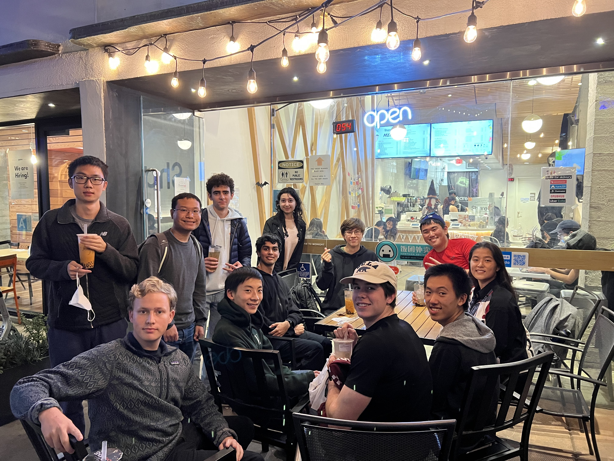

# Welcome to PBR!

<!-- https://www.w3schools.com/w3css/w3css_slideshow.asp -->

    
    
    

Psi Beta Rho (a.k.a. PBR or ψβρ) is UCLA's competetive cybersecurity team! We compete in CTFs or Capture the Flag events, where we solve cybersecurity challenges to earn points! We are a group of hackers, programmers, and security enthusiasts who love to learn and compete. We are a part of [ACM Cyber at UCLA](https://acmcyber.com/). Whether we are pwning a binary or attacking a site using cross-site scripting, we like to have fun! If you are a UCLA student, feel free to join us! No experience necessary! If you just want to check us out, our practice are always open to the public so be sure to swing by!

If you want to see who is on our team, check out our [team page](/team). To see some of our writeups, check out our [blog](/blog). If you are interested in seeing what we usually talk about, check out our [archive](/archive)! If you want to see what CTFs we have attended in the past, check out our [CTFs page](/ctfs).

To contact us, either email us at [uclacyber@gmail.com](mailto:uclacyber@gmail.com) or join the [ACM Cyber Discord](https://discord.gg/j9dgf2q).
